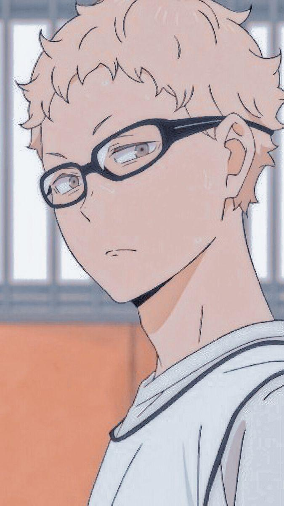

  
  

  
  
  

## Hi there 👋

- 🔭 I’m currently working on khatamat website
- 🌱 I’m currently learning django
- 👯 I’m looking to collaborate on khatamat website
- 🤔 I’m looking for help with ui/ux design and structuring the idea.
